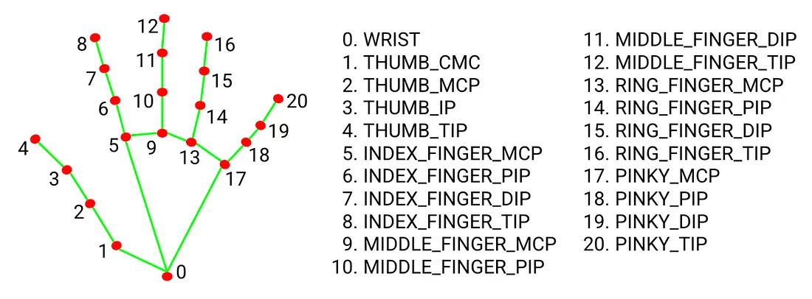

# KARA SYGNA PROJECT

Projeto de reconhecimento de sinais de mão utilizando **Python, OpenCV e MediaPipe**.

A aplicação captura imagens da câmera, detecta a mão, extrai seus landmarks e utiliza um modelo de Machine Learning para reconhecer sinais previamente treinados.

---
## Objetivo

O objetivo do projeto é explorar tecnologias de **visão computacional, Machine Learning e acessibilidade**, criando uma base para futuramente desenvolver uma solução capaz de reconhecer sinais manuais e convertê-los em texto.

---

## Tecnologias

* [Python 3.12.10](https://www.python.org/downloads/release/python-31210/)
* [OpenCV](https://docs.opencv.org/5.0/)
* [MediaPipe](https://pypi.org/project/mediapipe/)
* [Scikit-learn](https://scikit-learn.org/stable/)
* [Pandas](https://pandas.pydata.org/docs/user_guide/index.html#user-guide)
* [Joblib](https://joblib.readthedocs.io/en/stable/)
* Random Forest
---

## Configuração do Ambiente

Siga os passos abaixo para configurar e executar o projeto localmente.

### 1. Clonar o projeto

```bash
git clone <URL_DO_REPOSITORIO>
cd kara-sygna-py
```

### 2. Criar o ambiente virtual (Virtual Environment)

Recomendamos o uso da IDE **PyCharm** para este projeto. Para configurar o ambiente:

1. Abra a IDE **PyCharm**.
2. Vá em **New Project** (ou acesse as configurações de interpretador se já abriu a pasta).
3. Na aba **Interpreter type**, selecione **Project venv**.
4. Defina a versão do Python para **3.12.10**.

*Nota: Caso prefira criar o ambiente via terminal de forma manual, utilize o comando* 

```bash
python -m venv venv
```

### 3. Instalar as dependências

Com o ambiente virtual ativo, instale os pacotes necessários rodando:

```bash
pip install -r requirements.txt
```


## Executando o projeto

O projeto foi desenvolvido em etapas para facilitar o estudo e a evolução do reconhecimento de sinais.



### Fluxo de visão computacional

Testar a câmera, detectar a mão e identificar os landmarks:

```text
1. camera.py
      ↓
2. hand_tracker.py
      ↓
3. landmarks.py
      ↓
4. contar_dedos.py
```

### Fluxo da IA

Coletar os dados, aumentar as amostras, treinar o modelo e realizar o reconhecimento:

```text
1. coletar_dados.py
      ↓
2. aumentar_dados.py
      ↓
3. treinar_modelo.py
      ↓
4. reconhecer_sinais.py
```

### Painel de controle (tkinter)

O projeto também possui um **painel de controle** para executar o fluxo da IA de forma centralizada.

```text
app.py
  ↓
Painel de Controle - Kara SGYNA IA - Treinamento e Camera
  ├── Coletar dados
  ├── Treinar modelo
  └── Reconhecer sinais
```

O `app.py` funciona como ponto de entrada do fluxo, enquanto a lógica de cada etapa permanece organizada em seus respectivos módulos.


Depois, são coletadas automaticamente amostras da mão para aquele sinal.

Os dados são armazenados em:

```text
dados_sinais.csv
```

### Normalização

Os landmarks são normalizados utilizando `src/utils.py`.

A posição da mão é considerada de forma relativa ao pulso e a escala é ajustada pelo tamanho da mão. Dessa forma, o modelo não depende diretamente da posição ou distância da mão em relação à câmera.

> Se os dados foram coletados utilizando uma versão anterior da normalização, remova o `dados_sinais.csv` e faça a coleta novamente.


O script:

1. Carrega o `dados_sinais.csv`.
2. Separa os dados para treinamento e teste.
3. Treina um classificador **Random Forest**.
4. Exibe métricas de avaliação.
5. Salva o modelo treinado.

O modelo é salvo como:

```text
modelo_sinais.pkl
```

Faça um dos sinais utilizados durante o treinamento em frente à câmera.

O sistema apresenta o sinal reconhecido e o nível de confiança:

```text
Sinal: tres (98%)
```

Quando a confiança estiver abaixo do limite definido, o sistema apresenta:

```text
Incerto
```

Isso evita apresentar uma previsão quando o modelo não possui confiança suficiente.

---

## Problemas comuns

### MediaPipe não possui `solutions`

Erro:

```text
AttributeError: module 'mediapipe' has no attribute 'solutions'
```

O projeto utiliza uma versão específica do MediaPipe compatível com a API utilizada.

Instale:

```bash
pip install mediapipe==0.10.21
```

Ou reinstale todas as dependências:

```bash
pip install -r requirements.txt
```

### A câmera não abre

Verifique se outro programa, como Zoom ou Teams, está utilizando a câmera.

Se necessário, altere:

```python
cv2.VideoCapture(0)
```

para:

```python
cv2.VideoCapture(1)
```

### Erro ao instalar OpenCV

Verifique se está utilizando uma versão do Python compatível com as dependências do projeto e mantenha o `pip` atualizado:

```bash
python -m pip install --upgrade pip
```

## Próximos passos

* Adicionar novos sinais.
* Aumentar a quantidade e variedade das amostras.
* Melhorar a precisão do modelo.
* Organizar a aplicação em módulos reutilizáveis.
* Criar uma interface para controlar a aplicação.
* Evoluir o reconhecimento para tradução de *sinais* em texto utilizando IA.

---

**KARA SYGNA PROJECT**
Explorando tecnologia para aproximar pessoas através da comunicação.
